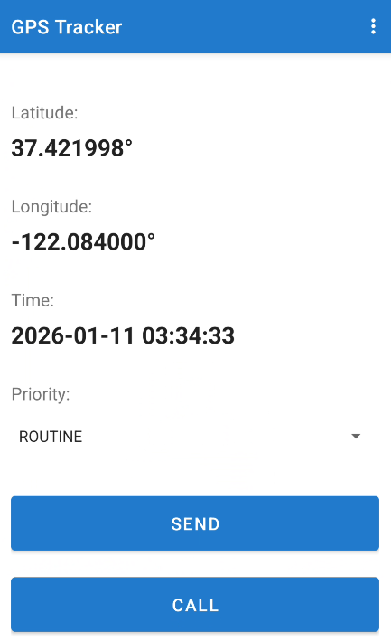
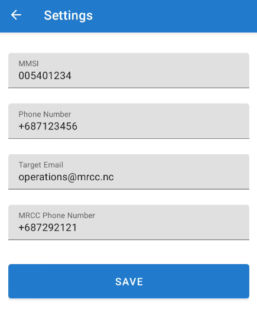

# MMSI and GPS sending App

This repository is a first experiment with Claude code. The used prompts are in the commit messages, and the 3 first ones were:
* `Can you create an android app that would have 1°/ settings (with fields "MMSI", "phone number", "target email"), 2°/ a main display that would show latitude/longitude/time from GPS, and a "SEND" button that would send an email to the aforementioned "target email" together with the MMSI, phone number, latitude, longitude, time informations`
* `In the main window (above "send" button), can you add a combo box with the following options: ["ROUTINE", "SECURITE", "PANPAN", "MAYDAY"], and have the email include that choice both in the subject and in the body of the email ?`
* `Can you add 1°/ an entry with "MRCC phone number" in the settings, and 2°/ on the main window, a button "call" that would trigger linphone (assuming linphone is previously pre-installed with the proper settings) in order to call the MRCC with the aforementioned MRCC phone number settings`

After compilation this gives the following

 

All what follows was written by Claude!

# GPS Tracker Android App

An Android application that tracks GPS location and sends position reports via email.

## Features

- **Real-time GPS tracking**: Displays current latitude, longitude, and timestamp
- **Settings management**: Store MMSI, phone number, and target email address
- **Email integration**: Send GPS position reports via your device's email app
- **Material Design UI**: Modern, clean interface with Material Design components

## Requirements

- Android Studio (2022.3.1 or later)
- Android SDK 24+ (Android 7.0+)
- Google Play Services
- Physical device or emulator with Google Play Services installed
- Location permissions

## Project Structure

```
app/
├── src/main/
│   ├── java/com/example/gpstracker/
│   │   ├── MainActivity.kt          # Main GPS display screen
│   │   ├── SettingsActivity.kt      # Settings configuration screen
│   │   └── PreferencesManager.kt    # Settings persistence manager
│   ├── res/
│   │   ├── layout/                  # XML layouts
│   │   ├── values/                  # Strings, colors, themes
│   │   └── menu/                    # Menu resources
│   └── AndroidManifest.xml
└── build.gradle.kts
```

## Setup Instructions

### 1. Install Android Studio

Download and install Android Studio from: https://developer.android.com/studio

### 2. Open Project

1. Open Android Studio
2. Select "Open an Existing Project"
3. Navigate to this directory and select it

### 3. Add App Icons (Required)

The app references launcher icons that need to be created. You have two options:

**Option A: Use Android Studio's Asset Studio**
1. Right-click on `app/src/main/res` in Android Studio
2. Select New → Image Asset
3. Configure your launcher icon
4. Click Finish

**Option B: Use placeholder icons**
Create these directories and add placeholder icon files:
```bash
mkdir -p app/src/main/res/mipmap-hdpi
mkdir -p app/src/main/res/mipmap-mdpi
mkdir -p app/src/main/res/mipmap-xhdpi
mkdir -p app/src/main/res/mipmap-xxhdpi
mkdir -p app/src/main/res/mipmap-xxxhdpi
```

Then copy default Android launcher icons to these directories, or download generic icons and name them:
- `ic_launcher.png`
- `ic_launcher_round.png`

### 4. Sync Gradle

Once the project is open, Android Studio will automatically sync Gradle. If not:
- Click "Sync Project with Gradle Files" in the toolbar

### 5. Build the App

```bash
./gradlew assembleDebug
```

Or use Android Studio:
- Build → Make Project (Ctrl+F9 / Cmd+F9)

### 6. Run the App

**On a Physical Device:**
1. Enable Developer Options on your device
2. Enable USB Debugging
3. Connect via USB
4. Click "Run" in Android Studio (or Shift+F10)

**On an Emulator:**
1. Create an AVD (Android Virtual Device) in Android Studio
2. Ensure it includes Google Play Services
3. Click "Run" in Android Studio

## Usage

### First Launch

1. The app will request location permissions - tap "Allow"
2. Open the menu (three dots) → Settings
3. Enter your:
   - **MMSI**: Maritime Mobile Service Identity number
   - **Phone Number**: Your contact phone number
   - **Target Email**: Email address where reports will be sent
4. Tap "SAVE"

### Sending Position Reports

1. Wait for GPS to acquire your location (latitude, longitude, time will display)
2. Tap the "SEND" button
3. Choose your email app
4. Review the pre-filled email with your GPS data
5. Send the email

## Permissions

The app requires the following permissions:

- `ACCESS_FINE_LOCATION`: For accurate GPS coordinates
- `ACCESS_COARSE_LOCATION`: For network-based location as fallback
- `INTERNET`: For email functionality (Intent-based, not direct SMTP)

## Technical Details

- **Language**: Kotlin
- **Min SDK**: 24 (Android 7.0)
- **Target SDK**: 34 (Android 14)
- **Location Provider**: Google Play Services FusedLocationProviderClient
- **Email**: Intent-based (launches device's email app)
- **Storage**: SharedPreferences for settings persistence

## Troubleshooting

### GPS not working
- Ensure location services are enabled on your device
- Go outside or near a window for better GPS signal
- Indoor locations may have weak GPS signal

### Email not sending
- Ensure you have an email app installed (Gmail, Outlook, etc.)
- Check that the target email is correctly formatted
- Verify you've configured settings

### Permission denied
- Go to Settings → Apps → GPS Tracker → Permissions
- Enable Location permission

## Build Outputs

After building, find the APK at:
```
app/build/outputs/apk/debug/app-debug.apk
```

## Installing APK Manually

```bash
adb install -r app/build/outputs/apk/debug/app-debug.apk
```

## License

This project is created as a custom GPS tracking solution.
